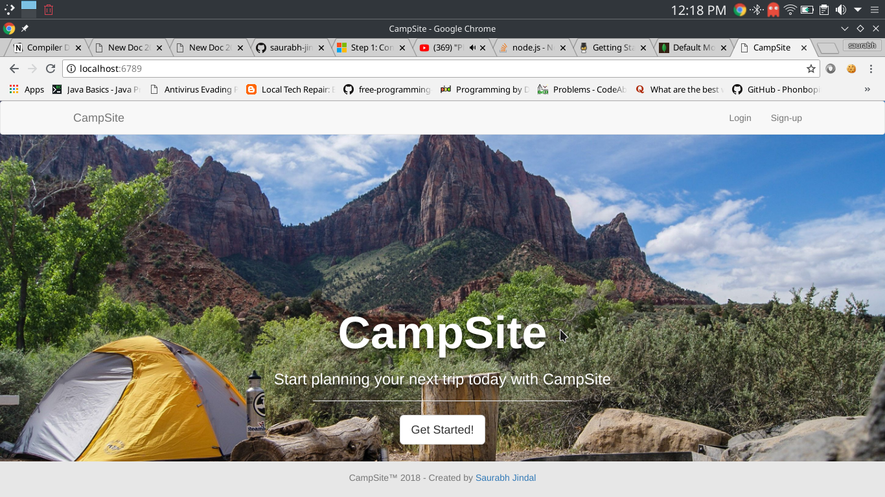
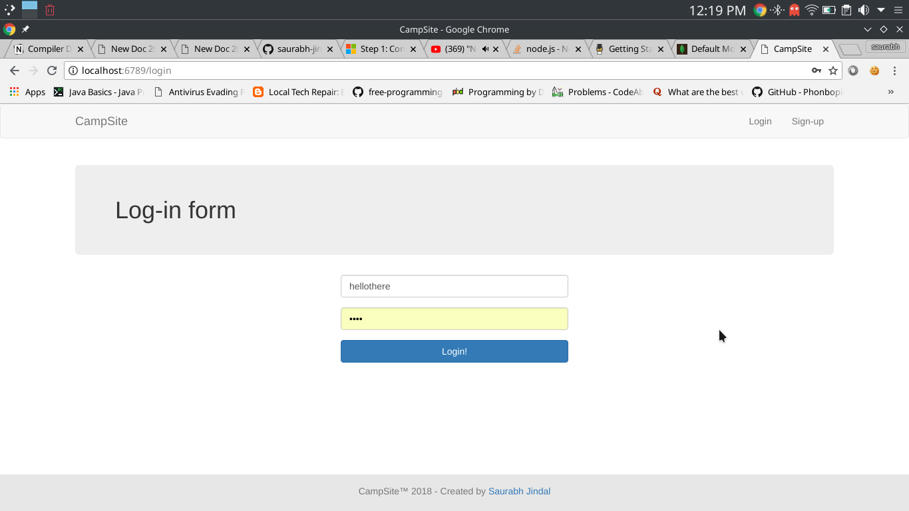
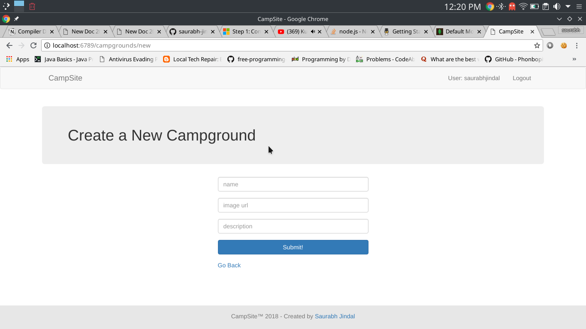

# CampSite

## A CampSite website using NodeJS.

## CampSite is created using:
NodeJs 

Express

MongoDB

User_Authentication 

Flash

Session-cokkies

## Features

* Authentication:
  
  * User login with username and password

  * Admin sign-up with admin code

* Authorization:

  * One cannot manage posts and view user profile without being authenticated

  * One cannot edit or delete posts and comments created by other users

  * Admin can manage all posts and comments

* Manage campground posts with basic functionalities:

  * Create, edit and delete posts and comments

  * Upload campground photos

  * Display campground location on Google Maps
  
  * Search existing campgrounds

* Manage user account with basic functionalities:

  * Profile page setup with sign-up

* Flash messages responding to users' interaction with the app

* Responsive web design

### Custom Enhancements

* Update campground photos when editing campgrounds

* Update personal information on profile page
 
## Getting Started
### Clone or download this repository

```sh
git clone https://github.com/saurabh-jindal/YelpCamp.git
```

### Install dependencies

```sh
npm install
```

or

```sh
yarn install
```

### Comments in code

Some comments in the source code are course notes and therefore might not seem necessary from a developer's point of view.

## Built with

### Front-end

* [ejs](http://ejs.co/)
* [Bootstrap](https://getbootstrap.com/docs/3.3/)

### Back-end

* [express](https://expressjs.com/)
* [mongoDB](https://www.mongodb.com/)
* [mongoose](http://mongoosejs.com/)
* [passport](http://www.passportjs.org/)
* [passport-local](https://github.com/jaredhanson/passport-local#passport-local)
* [express-session](https://github.com/expressjs/session#express-session)
* [method-override](https://github.com/expressjs/method-override#method-override)
* [nodemailer](https://nodemailer.com/about/)
* [connect-flash](https://github.com/jaredhanson/connect-flash#connect-flash)


### Steps to run

* mongod --port 9999
* mongo --port 9999
* npm start






